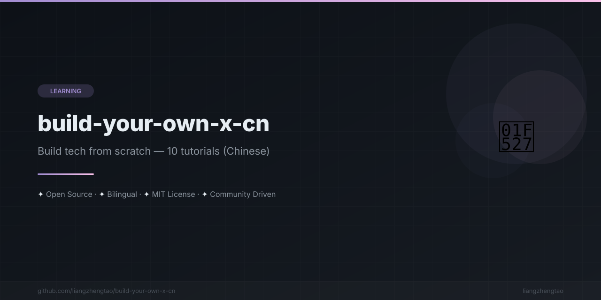

[English](README.md) | [中文](README.zh.md) | [日本語](README.ja.md) | [Français](README.fr.md) | [Español](README.es.md) | [العربية](README.ar.md) | [한국어](README.ko.md) | [Português](README.pt.md) | [Русский](README.ru.md) | [Deutsch](README.de.md)

# 🛠️ Build Your Own X (中文版)

**Maîtrisez la programmation en recréant vos technologies préférées de zéro. 10 tutoriels pratiques.**

---

La meilleure façon d'apprendre la programmation est de **pratiquer**. Au lieu de lire de la théorie, reconstruisez de zéro les technologies que vous utilisez tous les jours.

Ce projet est une collection sélectionnée de **tutoriels en chinois** qui vous guident pas à pas dans la construction de technologies fondamentales — systèmes d'exploitation, bases de données, serveurs web, langages de programmation, et plus — partant de zéro. Chaque tutoriel comprend :

- 📖 Des explications claires des concepts fondamentaux
- 💻 Des exemples de code complets et exécutables
- 🧩 Des guides d'implémentation étape par étape
- 🚀 Des défis avancés et des lectures complémentaires

### Liste des tutoriels

| # | Tutoriel | Difficulté | Durée | Langage |
|---|----------|------------|-------|---------|
| 1 | [Construisez votre propre OS](tutorials/构建你自己的操作系统.md) | ⭐⭐⭐⭐⭐ | 20+ h | C/Rust |
| 2 | [Construisez votre propre base de données](tutorials/构建你自己的数据库.md) | ⭐⭐⭐⭐ | 15+ h | Python/C |
| 3 | [Construisez votre propre serveur web](tutorials/构建你自己的Web服务器.md) | ⭐⭐⭐ | 8+ h | Python/Node.js |
| 4 | [Construisez votre propre langage de programmation](tutorials/构建你自己的编程语言.md) | ⭐⭐⭐⭐ | 12+ h | Python/Java |
| 5 | [Construisez votre propre blockchain](tutorials/构建你自己的区块链.md) | ⭐⭐⭐⭐ | 10+ h | Python/Go |
| 6 | [Construisez votre propre moteur de recherche](tutorials/构建你自己的搜索引擎.md) | ⭐⭐⭐ | 10+ h | Python |
| 7 | [Construisez votre propre Git](tutorials/构建你自己的Git.md) | ⭐⭐⭐⭐ | 8+ h | Python |
| 8 | [Construisez votre propre Docker](tutorials/构建你自己的Docker.md) | ⭐⭐⭐⭐⭐ | 15+ h | Go/Python |
| 9 | [Construisez votre propre réseau de neurones](tutorials/构建你自己的神经网络.md) | ⭐⭐⭐ | 10+ h | Python |
| 10 | [Construisez votre propre moteur de jeu](tutorials/构建你自己的游戏引擎.md) | ⭐⭐⭐⭐ | 15+ h | C++/Rust |

### Pourquoi « construisez votre propre » ?

> "What I cannot create, I do not understand." — Richard Feynman

En construisant une technologie de zéro, vous allez :
- Comprendre en profondeur les principes sous-jacents, bien au-delà des appels API
- Développer une pensée systémique et des compétences en conception d'architecture
- Démontrer votre profondeur technique en entretien
- Acquérir des compétences de programmation véritablement transférables

### Contribuer

Les contributions sont les bienvenues ! Veuillez lire le [guide de contribution](CONTRIBUTING.md).

---

Made with ❤️ by the community

